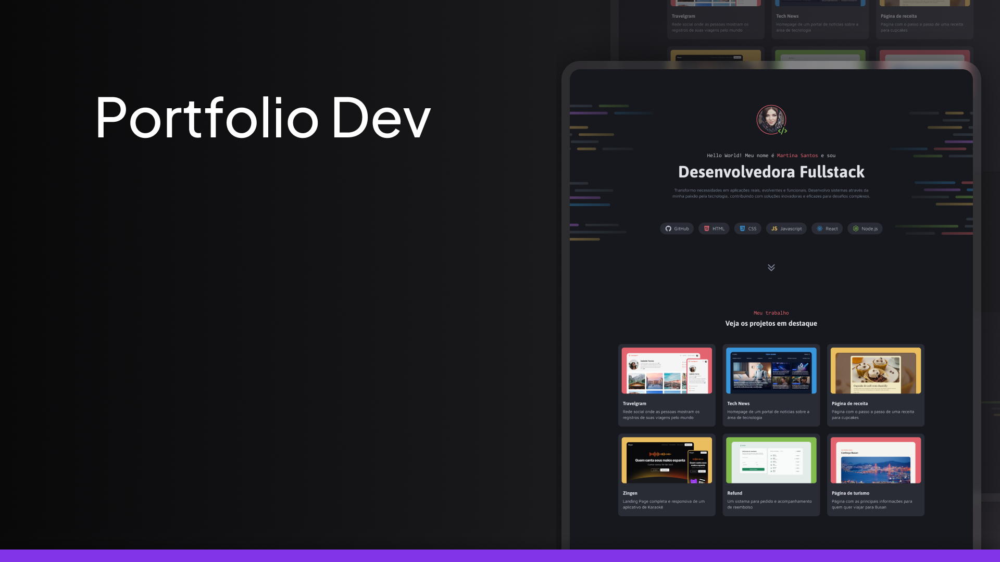

<h1 align="center"> Portfólio </h1>

Developer Portfólio  

  <a href="#-tecnologias">Technologies</a>&nbsp;&nbsp;&nbsp;|&nbsp;&nbsp;&nbsp;
  <a href="#-Project">Project</a>&nbsp;&nbsp;&nbsp;|&nbsp;&nbsp;&nbsp;
  <a href="#-layout">Layout</a>&nbsp;&nbsp;&nbsp;

 

  

## 🚀 Technologies

This project was developed with the following technologies:

- HTML e CSS
- Git e Github
- Figma

## 💻 Project

Developer Portfólio.

- [Access the finished project online](https://gusfornari.github.io/Portfolio/)

## 🔖 Layout